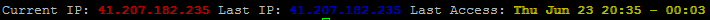

# update-motd.d

Hi there! 👋

Welcome to our `/etc/update-motd.d` folder.

You all know what the `/etc/motd` (Message of the Day) file is: since time immemorial, all Unixes print it during login. It's a pure ASCII text file which can be changed at any time.

Contemporary Unix systems, however, have added the possibility of *dynamic* messages of the day, created every time someone logs in. This is a simple, yet effective way of presenting a quick overview of the system at the moment of logging in (at the cost of some overhead in processing the data for presentation).

Most Debian-based distributions will use the `/etc/update-motd.d` directory to store executable (shell) scripts which will run in alphabetic order (they're therefore conventionallu written as `00-first`, `10-second`, etc.) to produce a dynamic message of the day, stored at `/run/motd.dynamic` or `/run/motd`. To this, Debian-based distros will usually add `/etc/motd` to the bottom, as a static (and permanent) informational message.

Non-Debian-based Linux distros and other OSes may have different ways of configuring their dynamic MoTD. For example, they *may* have a special shell script under `/etc/profile.d/motd.sh`.

In those cases, you might wish to consult [this reference on LinuxConfig](https://linuxconfig.org/how-to-set-a-custom-message-of-the-day-on-linux) instead. You can continue to use the scripts within this repository, though; you will just need to add a single line with `run-parts /etc/update-motd.d` inside your `motd.sh`.

The authors of this repository, however, have not experimented this alternative.

## Downloading and installing (Debian-based Linux distros)

You can download this package with the git command
```shell
git clone https://github.com/SHelfinger/update-motd.d/ ~/
```
The complete git repo will be placed inside your home folder (`cd ~/`).

By default, you will already have the executable bit set on all files in that folder, but if this isn't the case, please make them executable with `chmod +x *-*`.

After you're done with testing each file (`./10-version`, etc.), feel free to install the ones you wish by copying them to their final destination:
```shell
cp 00-header /etc/update-motd.d/00-header
cp 10-version /etc/update-motd.d/10-version
cp 20-cpu /etc/update-motd.d/20-cpu
cp 21-temp /etc/update-motd.d/21-temp
cp 30-hdd /etc/update-motd.d/30-hdd
cp 40-memory /etc/update-motd.d/40-memory
cp 50-systop /etc/update-motd.d/50-systop
cp 50-lastlogin /etc/update-motd.d/50-lastlogin
cp 90-fail2ban /etc/update-motd.d/90-fail2ban
```
Again, note that non-Debian Linux, and non-Linux systems, might require a differen configuration; refer to the previous section for a short introduction.

## Dependencies

Note that some of those files have dependencies, such as `lm-sensors`, `bc` and [`crudini`](https://www.pixelbeat.org/programs/crudini/). Each file lists its own dependencies (beyond the [standard GNU core utilities](https://www.gnu.org/software/coreutils/) you'll also need `awk`, `grep`, `sed`, etc.) — make sure you install them all first (or skip the file if you don't want some of the functionality).

Some of the files use Python for short one-liners. Python 2 is assumed, but some tweaks have been made to allow the scripts to run under Python 3 as well.

## Integration with `sshd` and `pam.d`

Under Debian-based Linux distributions, we now need to tell the SSH daemon that it needs to get the `/run/motd` file.

Make first sure that SSHD is restarted (`service sshd restart`) then check is motd updated (`cat /run/motd`)

When you see your new `motd` being displayed, you can then assign it to your `pam.d` settings for the SSH daemon:

1. Open the file for `sshd`:
```shell
  sudo nano /etc/pam.d/sshd
```
2. Change:
```
  session    optional     pam_motd.so  motd=/run/motd.dynamic
```
   to:
```
  session    optional     pam_motd.so  motd=/run/motd
```
3. Then press <kbd>CTRL</kbd>+<kbd>O</kbd> **and** <kbd>CTRL</kbd>+<kbd>X</kbd> to save everything on the `nano` editor.

4. Now relog into your server!

### Caveats

1. If you enable *all* the scripts in this package, and you have a slow, underpowered system (such as a humble Raspberry Pi!), collecting all data and properly formatting it *might* take a perceptible delay — a few seconds. This means waiting those few seconds *every time you log in* (since the `motd` is generated on demand during the login process). None of the utilities here have been designed with some sort of cache in mind. In particular, *if* the system is already under a heavy load, and one wishes to log in to fix it, the login procedure *may* take eternities to run!
Future versions *might* either have a cache in place, *or* skip the most heavy and expensive scripts *if* the system is too slow (as Ubuntu does when calculating the system load). 
2. In some systems, you do not need to change `/etc/pam.d/sshd` at all (and shouldn't!); the default `motd=/run/motd.dynamic` does all the work, **but** you might need to place a symbolic link to it:
```shell
  sudo ln -s /run/motd.dynamic /run/motd
```
3. In some systems, you might be able to *force* a change by running `update-motd`. It will not only run all the scripts and display the output, but it will *also* add the output to `/run/motd`. In some circumstances, this might overwrite the symbolic link mentioned before, so take care with this approach.
4. Beware that the original scripts were tested and designed on Intel architectures. Under ARM, some commands may give different results (or not work at all). For example, while `sensors` (from the `lm-sensors` package) provides a neat breakout of CPU temperature *per core*, ARM chips tend to consolidate all measurements into a single *virtual* core — very likely because, compared to Intel CPUs, ARM CPUs *may* be so small that they lack independen temperature sensors for each core. The scripts here were slightly tweaked to get at least *something* to be displayed under ARM architectures, but these might not work at all under many variants, even if their Intel counterpart works beautifully.

### macOS

macOS, of course, is *not* Debian-based Linux: what Apple calls "macOS" is essentially the graphics interface that allows end-users to run Darwin (a BSD derivative) in a friendly way.

The closest you can get on macOS is to install [macMOTD](https://github.com/aremmell/macMOTD/), which will launch a small daemon in the background to periodically generate a `/etc/motd` file. It *will* search for scripts under `/etc/update-motd.d` as well (two tests/examples are supplied). However, *most* of the commands to extract system data to be processed are completely different; a few 'helper scripts' have *also* be included, but don't expect to be able to use *this* package as it is running on a Mac — a lot needs to be changed & adapted. Also take into account that repository uses macOS's now-default shell, `zsh`, instead of `bash`, which, again, needs some adaptation.

Other packages for the Mac simply rely on adding an extra line on `~/.bash_profile`. This runs contrary to the *spirit* of MoTD — a Message of The Day for *all* users, not only for those who happen to have 'opted-in' to receive them and have configured their personal environment to do so. Nevertheless, they *are* valid alternatives.

### Alternatives!

If you find that these scripts are not exactly what you're looking for, you can always take a look at [HyFetch](https://github.com/hykilpikonna/hyfetch) instead. It's a completely different system, forked from the popular Neofetch (now a defunct and archived project) with (optional) LGBTQI+ colouring. The [Wikipedia page for Neofetch](https://en.wikipedia.org/wiki/Neofetch#Other_implementations) also lists many other similar projects.

## Content

### Table of contents
- [All together](#all-together)
- [00-header](https://github.com/SHelfinger/update-motd.d#00-header)
- [10-version](https://github.com/SHelfinger/update-motd.d#10-version)
- [20-cpu](https://github.com/SHelfinger/update-motd.d#20-cpu)
- [21-temp](https://github.com/SHelfinger/update-motd.d#21-temp)
- [30-hdd](https://github.com/SHelfinger/update-motd.d#30-hdd)
- [40-memory](https://github.com/SHelfinger/update-motd.d#40-memory)
- [50-systop](https://github.com/SHelfinger/update-motd.d#50-systop)
- [50-lastlogin](https://github.com/SHelfinger/update-motd.d#60-lastlogin)
- [90-fail2ban](https://github.com/SHelfinger/update-motd.d#90-fail2ban)

---
### All together

**Note:** We have created some more features which haven't been included in this repository. If you really need them, please send us a mail/message.


---
### 00-header
This script will simply write the hostname (just the machine name, not the FQDN). It requires installing the popular [`figlet`](http://www.figlet.org/) or its (improved) alternative [`toilet`](http://caca.zoy.org/wiki/toilet), as well as whatever ASCII fonts you like best.

Debian output:
```shell
 ____  _   _      _  __ _                         ____             _
/ ___|| | | | ___| |/ _(_)_ __   __ _  ___ _ __  / ___|  __ _ _ __| |
\___ \| |_| |/ _ \ | |_| | '_ \ / _` |/ _ \ '__| \___ \ / _` | '__| |
 ___) |  _  |  __/ |  _| | | | | (_| |  __/ |     ___) | (_| | |  | |
|____/|_| |_|\___|_|_| |_|_| |_|\__, |\___|_|    |____/ \__,_|_|  |_|
								|___/
```
Screenshot:  


---
### 10-version
This script will output the Distribution and its Version Number (Code name, Kernel, Architecture)

Debian output:
```shell
Linux Debian 8.5 (jessie 4.4.8-1-pve x86_64)
```
Screenshot:  


---
### 20-cpu
This script will output each core's load in percentage, including the total load. The histogram is User, Nice, System, I/O Wait and Free).

It relies on the ubiquitous `bc`, `grep`, Python 2 (but including a small patch allowing Python 3 to be used) but also on `mpstat`.

Debian output:
```shell
CPU ALL (Load/Idle) [IIIIIIIIIIIIIIIIIIIIIIIIIIIIIIIIIIIIIIIIIIIIIIIIIIIIIIIIIIIIIIIIIIIIIIIIIIIIIIIIIIIIIIIIIIIIIIIIIIII] 4%/96%
	 01 (Load/Idle) [IIIIIIIIIIIIIIIIIIIIIIIIIIIIIIIIIIIIIIIIIIIIIIIIIIIIIIIIIIIIIIIIIIIIIIIIIIIIIIIIIIIIIIIIIIIIIIIIIIII] 8%/92%
	 02 (Load/Idle) [IIIIIIIIIIIIIIIIIIIIIIIIIIIIIIIIIIIIIIIIIIIIIIIIIIIIIIIIIIIIIIIIIIIIIIIIIIIIIIIIIIIIIIIIIIIIIIIIIIII] 8%/92%
	 03 (Load/Idle) [IIIIIIIIIIIIIIIIIIIIIIIIIIIIIIIIIIIIIIIIIIIIIIIIIIIIIIIIIIIIIIIIIIIIIIIIIIIIIIIIIIIIIIIIIIIIIIIIIIII] 7%/93%
	 04 (Load/Idle) [IIIIIIIIIIIIIIIIIIIIIIIIIIIIIIIIIIIIIIIIIIIIIIIIIIIIIIIIIIIIIIIIIIIIIIIIIIIIIIIIIIIIIIIIIIIIIIIIIIII] 7%/93%
	 05 (Load/Idle) [IIIIIIIIIIIIIIIIIIIIIIIIIIIIIIIIIIIIIIIIIIIIIIIIIIIIIIIIIIIIIIIIIIIIIIIIIIIIIIIIIIIIIIIIIIIIIIIIIIII] 8%/92%
	 06 (Load/Idle) [IIIIIIIIIIIIIIIIIIIIIIIIIIIIIIIIIIIIIIIIIIIIIIIIIIIIIIIIIIIIIIIIIIIIIIIIIIIIIIIIIIIIIIIIIIIIIIIIIIII] 5%/95%
	 07 (Load/Idle) [IIIIIIIIIIIIIIIIIIIIIIIIIIIIIIIIIIIIIIIIIIIIIIIIIIIIIIIIIIIIIIIIIIIIIIIIIIIIIIIIIIIIIIIIIIIIIIIIIIII] 5%/95%
	 08 (Load/Idle) [IIIIIIIIIIIIIIIIIIIIIIIIIIIIIIIIIIIIIIIIIIIIIIIIIIIIIIIIIIIIIIIIIIIIIIIIIIIIIIIIIIIIIIIIIIIIIIIIIIII] 5%/95%
```

Screenshot:  


---
### 21-temp
This script will output the current temperature(s) in all the cores (in degrees Celsius). Remember that Intel i7 doesn't really have 8 cores — it has 4 cores and 4 siblings — see `cat /proc/cpuinfo`. Similarly, the very small ARM chips may just have a single, so-called "virtual" temperature sensor, which is measured for all cores and subsystems inside the chip.

It depends on the `lm-sensors` package to be installed (which will include an executable named `sensors`) and attempts to parse the output in order to display it with different colours, depending on how close the temperature is to the critical limit (future versions might rely on the JSON output instead, which should be more stable and easy to extract, at the cost of requiring `jq` as a pre-requisite or a similar JSON processor).

Debian output: 
```shell
Core1: 41° Core2: 42° Core3: 40° Core4: 35°
```
Screenshot:  


---
### 30-hdd
This script will output a usage/free histogram for all hard disks found in the system (as well as a percentage). Note that some Unix variants may display all filesystems instead of just the actual hard disks (i.e., including remotely mounted systems); the script tries to figure out the more popular device names and just show statistics for those, but some errors may occur on certain hardware.

Actual information is retrieved using the `df` command, which is part of the GNU Core Utilities.

Debian output:
```shell
HDD /dev/md1 (Usage/Free) [IIIIIIIIIIIIIIIIIIIIIIIIIIIIIIIIIIIIIIIIIIIIIIIIIIIIIIIIIIIIIIIIIIIIIIIIIIIIIIIIIIIIIIIIIIIIIIIIIIII] 11%/89%
HDD /dev/md2 (Usage/Free) [IIIIIIIIIIIIIIIIIIIIIIIIIIIIIIIIIIIIIIIIIIIIIIIIIIIIIIIIIIIIIIIIIIIIIIIIIIIIIIIIIIIIIIIIIIIIIIIIIIII] 5%/95%
HDD /dev/md3 (Usage/Free) [IIIIIIIIIIIIIIIIIIIIIIIIIIIIIIIIIIIIIIIIIIIIIIIIIIIIIIIIIIIIIIIIIIIIIIIIIIIIIIIIIIIIIIIIIIIIIIIIIIII] 4%/96%
```
Screenshot:  


---
### 40-memory
This script will output the current system memory usage (User, Buffers, System and Cache).

It only depends on the availability of `bc` ('the **b**asic **c**alculator') to aid in some of the calculations and of `free` to display the actual memory usage.

Debian output:
```shell
Memory (Mem) (UBSC/Free) [IIIIIIIIIIIIIIIIIIIIIIIIIIIIIIIIIIIIIIIIIIIIIIIIIIIIIIIIIIIIIIIIIIIIIIIIIIIIIIIIIIIIIIIIIIIIIIIIIIII] 22%/78%
Memory (Swap) (Usage/Free) [IIIIIIIIIIIIIIIIIIIIIIIIIIIIIIIIIIIIIIIIIIIIIIIIIIIIIIIIIIIIIIIIIIIIIIIIIIIIIIIIIIIIIIIIIIIIIIIIIIII] 2%/98%
```

Screenshot:  


---
### 50-systop
This script will output your system network information (Hostname, DNS, FQDN and IP).

It does not require any dependencis.


Debian output:
```shell
Hostname proxmox DNS shelfinger.eu FQDN proxmox.shelfinger.eu IP 144.76.32.43
```

Screenshot:  


---
### 60-lastlogin
This script will output the last login access and current IP for this session.

It just uses very common text-processing utilities (`head` and `tail`, both available on the GNU Core Utilities, plus `awk` and `sed`) as well as the `last` command-line utility to retrieve a list of recent logins.

Debian output:
```shell
Current IP: 41.207.182.235 Last IP: 41.207.182.235 Last Access: Thu Jun 23 20:35 - 00:03
```

Screenshot:  


---
### 90-fail2ban
This script will output the Top 10 from today's bans, aggregated by jail.

Naturally, it requires `fail2ban` to be properly configured and actively scanning through logs, and banning IP addresses as it identifies potential sources of attacks (if it's not installed, the script will silently abort). An additional requirement is `crudini` for parsing configuration files.

Debian output:
```shell
Fail2Ban Today's Ban Statistics
		1       155.133.38.33   (recidive)
		1       155.133.38.33   (sasl)
```

Screenshot:  

